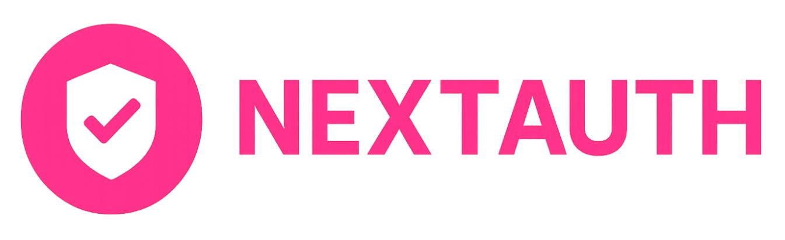

<!-- BANNER -->
<p align="center">
  
</p>

<h1 align="center">✅ NEXTAUTH</h1>
<p align="center">
  <b>Next.js와 Prisma DB를 이용한 로그인(세션+쿠키) 관리 프로젝트/b>
</p>

<!-- BADGES -->
<p align="center">
  
  
  
  
  

</p>

---

## 🌈 주요 기능
- 📝 **로그인 관리** 세션 + 쿠키 활용 및 실시간으로 Prisma 웹 DB에 저장  

---

## 🛠 기술 스택
<p align="center">
  
  
  
  
  
</p>

---

## 📦 설치 및 실행
```bash
# 1) 레포지토리 복제
git clone https://github.com/choidy180/nextauth-credentials
cd nextauth-credentials

# 2) 의존성 설치
npm install

# 3) 개발 서버 실행
npm run dev
# 브라우저에서 http://localhost:3000 & http://127.0.0.1:3000 접
```

## 📡 Example Code (Prisma Db Code)
```bash

// This is your Prisma schema file,
// learn more about it in the docs: https://pris.ly/d/prisma-schema

generator client {
  provider = "prisma-client-js"
}

datasource db {
  provider = "sqlite"
  url      = "file:mydb.db"
}

model User {
  id        Int      @id @default(autoincrement())
  email     String   @unique
  name      String?
  password  String
  createdAt DateTime @default(now()) @map(name: "created_at")
  updatedAt DateTime @updatedAt @map(name: "updated_at")
}
```
